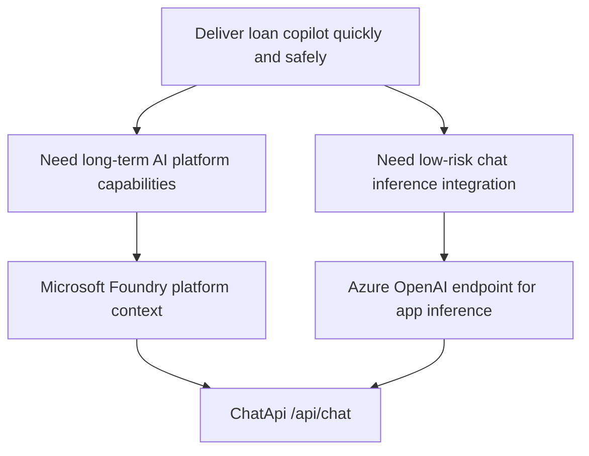

# ADR-0001: Use Foundry As The Platform Context And Azure OpenAI Endpoint For Chat Inference

## Status

Accepted

## Date

2026-03-21

## Context

The loan copilot needs a reliable way to serve chat responses quickly while preserving room for future capabilities such as evaluations, agent workflows, and retrieval.

We considered two closely related but different choices:

- Use Microsoft Foundry as the broader AI platform and project context
- Use an Azure OpenAI endpoint and SDK flow for the application chat inference path

The team needs a decision that is easy to explain to stakeholders, minimizes delivery risk, and does not block future growth.

## Decision

We will:

- Use Microsoft Foundry as the platform and governance context
- Use the Azure OpenAI endpoint and OpenAI SDK pattern for `/api/chat` inference

This means the application will call the Azure OpenAI deployment directly for chat completions, while the surrounding solution can still evolve into broader Foundry capabilities later.

## Decision Diagram

## Rationale

- The application’s immediate need is chat inference, not the full Foundry feature surface.
- The Azure OpenAI endpoint gives a simpler and lower-risk path for chat integration.
- Foundry remains strategically valuable for platform governance, evaluation, and future AI workflow expansion.
- This split keeps the frontend contract stable while allowing backend implementation to evolve.

## Consequences

### Positive

- Faster delivery for the current chat use case
- Lower implementation and support risk for the first production path
- Clear stakeholder story: platform decision and inference decision are not the same thing
- Easier migration into richer Foundry capabilities later

### Negative

- The architecture is slightly more nuanced to explain than choosing a single label for everything
- Some future capabilities may require additional integration work if we move deeper into Foundry-native workflows
- Teams must stay clear on which endpoint and SDK are used for which purpose

## Alternatives Considered

### 1. Use Foundry endpoint and project surface for everything

Pros:

- Strong platform standardization story
- Broader lifecycle and project capability alignment

Cons:

- More moving parts than needed for the immediate chat requirement
- Higher delivery risk for the first implementation
- Less direct fit for a focused OpenAI chat integration path

### 2. Use only Azure OpenAI and ignore Foundry platform considerations

Pros:

- Simplest immediate developer experience
- Fastest path to a basic working chat app

Cons:

- We would underuse the broader Azure AI platform story
- Harder stakeholder conversation later when governance, evaluation, or multi-model concerns appear

## Stakeholder Summary

Foundry is the platform choice. Azure OpenAI is the application inference choice.

This gives us the best balance of speed now and flexibility later.
