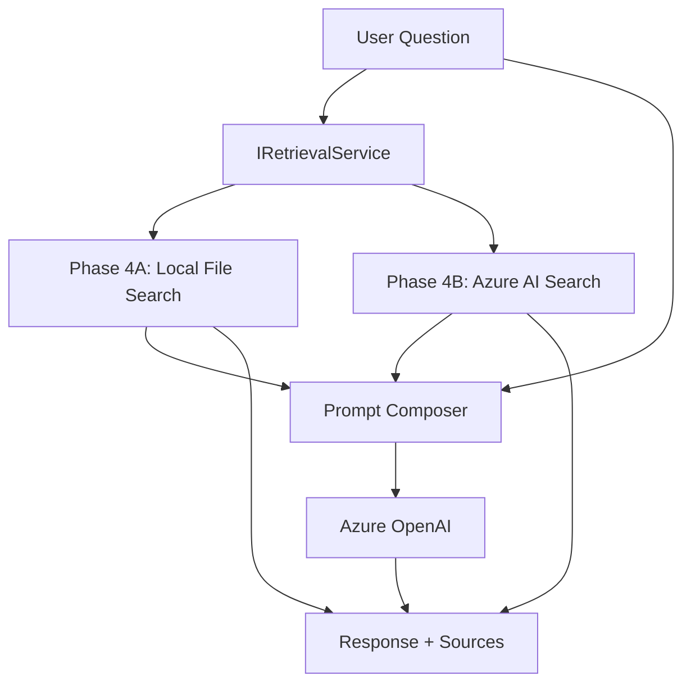

# ADR-0002: Retrieval Strategy and Backend for Phase 4 RAG

## Status

Accepted

## Date

2026-03-22

## Context

The loan copilot currently answers questions using only Azure OpenAI's trained knowledge.
Responses are generic and cannot reference lender-specific guidelines, policy documents,
or loan program details that live outside the model's training data.

Phase 4 adds a retrieval layer so that answers are grounded in domain-specific content
before the prompt reaches Azure OpenAI.

Several decisions must be made before implementation:

- Which retrieval backend to use
- How retrieved content enters the LLM prompt
- Where citations come from (the model or the retrieval layer)
- How documents are chunked and scored

The decision must support a fast Phase 4A delivery without closing off a production-grade
Phase 4B path.

## Decision

We will implement retrieval in two sub-phases behind a single `IRetrievalService` abstraction:

**Phase 4A** — local file-based keyword retrieval over markdown knowledge documents in `data/loan-kb/`

**Phase 4B** — Azure AI Search with hybrid (BM25 + vector) retrieval

For context injection, retrieved snippets are prepended to the system prompt in Phase 4A,
with the message structure designed to support a separate context message pattern in Phase 4B.

Citations are sourced from the retrieval layer as structured metadata, not generated by the LLM.

## Decision Diagram

## Rationale

### Why local files for Phase 4A

- Zero infrastructure: no index, no embedding service, no API keys beyond what already exists
- Proves the prompt composition pattern and the service abstraction boundary in a day
- Knowledge files are human-auditable markdown — easy to add, review, and version-control
- The `IRetrievalService` interface hides the backend; ChatApi never changes when we upgrade

### Why Azure AI Search for Phase 4B

- Managed hybrid search (BM25 + semantic/vector) without running a vector database
- Already within the Azure platform story established by ADR-0001
- Supports document indexing, filtering, and freshness updates
- Complements the Foundry platform direction for governance and evaluation

### Why structured citations, not LLM-generated

- LLMs can hallucinate source names even when told to cite accurately
- The retrieval layer knows exactly what it returned — this is ground truth
- Structured `sources[]` in the API response lets the UI render citations reliably
- Prompt engineering for in-prose citations can be layered on top later

### Why paragraph/section chunking for 4A

- Markdown knowledge files use `##` section headers as natural chunk boundaries
- Each section is a coherent concept — better for both retrieval precision and model comprehension
- Chunks remain human-readable, making quality checks straightforward

## Consequences

### Positive

- Phase 4A delivers visible improvement with no new infrastructure
- The abstraction boundary means ChatApi is not coupled to any specific retrieval backend
- Structured source metadata enables reliable UI citation rendering
- The tag system (`"with-retrieval"`, `"retrieval-miss"`) makes retrieval quality observable from day one
- Token budgeting for retrieved context is a first-class concern from the start

### Negative

- Phase 4A keyword search has low recall for semantic queries (e.g., "how much cash do I need upfront?" will not match a document titled "Closing Cost Breakdown" without keyword overlap)
- Context window management adds complexity: retrieved snippets consume tokens from the same budget as the model's output
- Single-turn retrieval cannot use conversation history for query formulation — a Phase 4B concern

## Alternatives Considered

### 1. Skip Phase 4A and go directly to Azure AI Search

Pros:

- Production-quality retrieval from the start
- No throwaway code

Cons:

- Requires indexing pipeline, Azure AI Search resource provisioning, and embedding model decisions before any retrieval value is delivered
- Couples the first working RAG demo to infrastructure availability
- Harder to validate prompt composition patterns before retrieval quality concerns enter

### 2. Use a vector database (Qdrant, Pinecone, Weaviate)

Pros:

- Strong semantic similarity search
- Many open-source options

Cons:

- Adds a system outside the Azure platform, complicating governance
- Embedding model must be chosen, deployed, and kept in sync with the index
- Higher operational surface area than Azure AI Search for this use case

### 3. Azure OpenAI on Your Data (built-in RAG)

Pros:

- Minimal code — Azure handles retrieval and prompt augmentation
- Integrated Azure AI Search backend

Cons:

- Less control over prompt composition, chunk selection, and citation format
- Harder to observe and debug retrieval quality
- Reduces the architectural learning surface of this project

## Retrieval Quality Signals

From the first deployment, the API response `tags` field carries retrieval outcome signals:

| Tag | Meaning |
|---|---|
| `"with-retrieval"` | At least one snippet exceeded the relevance threshold |
| `"retrieval-miss"` | No snippets cleared the threshold; model answered from training |
| `"retrieval-error"` | Retrieval call failed; model answered from training as fallback |

These tags enable downstream evaluation without additional instrumentation.

## Token Budget Policy

Retrieved context must not silently overflow the context window.

- `AzureOpenAiOptions.MaxOutputTokens` (existing) governs model output
- A `MaxRetrievalTokens` budget will be introduced alongside `IRetrievalService`
- Snippets are ranked by score and truncated to fit within `MaxRetrievalTokens`
- If the budget is exceeded, lower-scoring snippets are dropped, not the user's question

## Stakeholder Summary

Phase 4A uses simple file-based search to prove that retrieved context improves answers
with no new infrastructure. Phase 4B upgrades the backend to Azure AI Search for
production-grade retrieval quality. The application code does not change between phases —
only the retrieval backend behind `IRetrievalService` is swapped.
