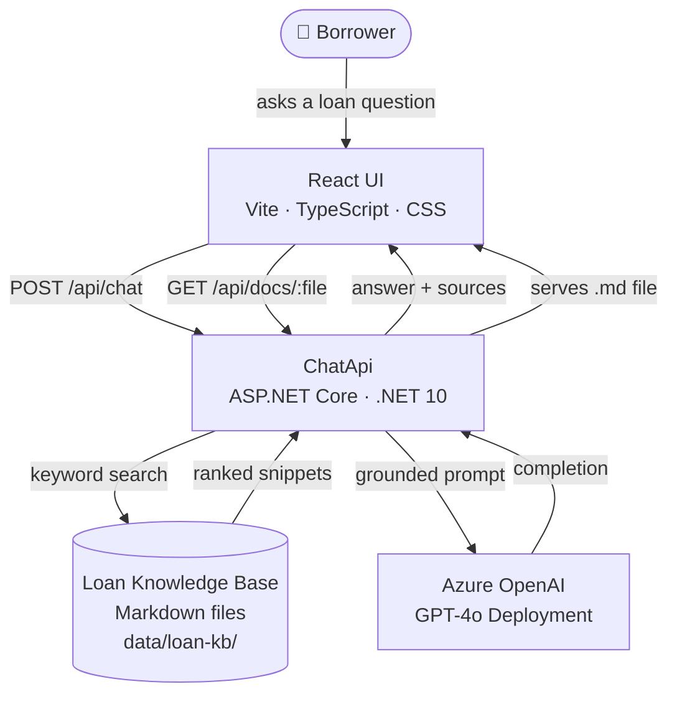
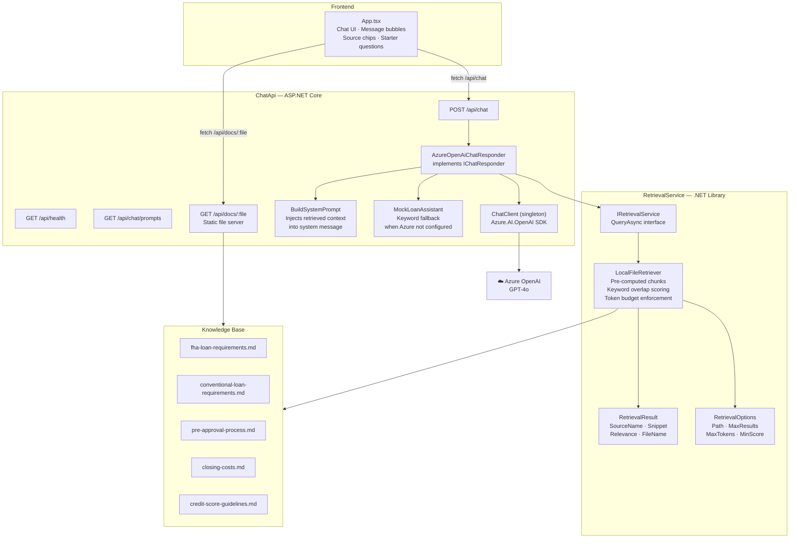
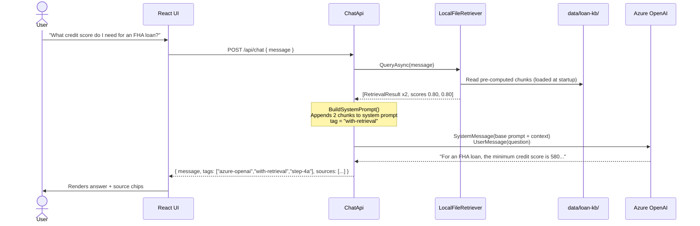
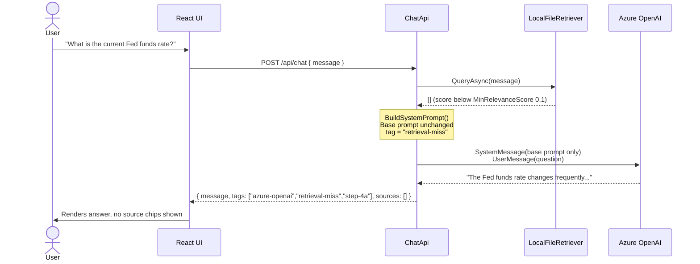
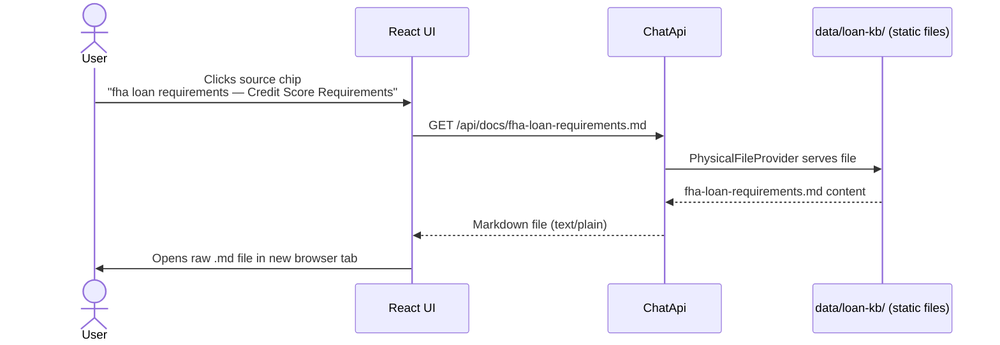

# Architecture Overview — Basic Phase (1–4A)

---

## 1. System Context

Who uses the system and what external dependencies exist.



---

## 2. Component Architecture

Internal structure of the backend and how the projects relate.



---

## 3. Request Flow — Grounded Answer (Retrieval Hit)

The happy path when the knowledge base contains relevant content.



---

## 4. Request Flow — No Retrieval Match

When no knowledge base content matches the query.



---

## 5. Request Flow — Source File Navigation

When the user clicks a source chip to read the original document.



---

## 6. Tech Stack

| Layer | Technology | Version | Role |
|---|---|---|---|
| Frontend | React | 19.2.4 | Chat UI, message rendering, source chips |
| Frontend | TypeScript | 5.9 | Type-safe API contract |
| Frontend | Vite | 8.x | Dev server, build, API proxy |
| Backend | ASP.NET Core | .NET 10 | REST API, static file server |
| Backend | Azure.AI.OpenAI | 2.1.0 | Azure OpenAI SDK |
| Backend | C# | 13 | Primary application language |
| AI | Azure OpenAI | GPT-4o | Chat completion |
| Retrieval | Local file search | — | Keyword overlap scoring, section chunking |
| Knowledge Base | Markdown files | — | 5 loan domain documents |
| Config | appsettings.json | — | Azure credentials, retrieval options |
| Secrets | .NET User Secrets | — | API keys in development |

---

## 7. Project Structure

```
azure-ai-loan-copilot/
├── PLAN.md                        ← phase roadmap and status
├── data/
│   └── loan-kb/                   ← knowledge base (5 .md files)
├── docs/
│   ├── basic/                     ← Phase 1–4A docs
│   └── *.md                       ← cross-phase references
├── src/
│   ├── ChatApi/                   ← ASP.NET Core Web API
│   │   ├── Program.cs             ← endpoints, DI, static files
│   │   ├── Configuration/         ← AzureOpenAiOptions
│   │   └── Services/              ← IChatResponder, AzureOpenAiChatResponder, ChatResult
│   ├── RetrievalService/          ← .NET class library
│   │   ├── IRetrievalService.cs
│   │   ├── LocalFileRetriever.cs
│   │   ├── RetrievalResult.cs
│   │   └── RetrievalOptions.cs
│   ├── frontend-react/            ← React + TypeScript
│   │   └── src/
│   │       ├── App.tsx            ← chat UI, message bubbles, source chips
│   │       └── App.css
│   ├── AgentService/              ← stub (Phase 5+)
│   └── SharedKernel/              ← stub (future shared models)
└── tests/
```

---

## 8. Key Design Decisions

| Decision | Choice | Rationale |
|---|---|---|
| Retrieval abstraction | `IRetrievalService` interface | Swap local → Azure AI Search in Phase 4B without changing ChatApi |
| Context injection | System prompt enrichment | Simple, effective for small retrieved sets |
| Citation source | Retrieval layer metadata | Reliable — not LLM-generated, no hallucination risk |
| HTTP client | `Lazy<ChatClient>` singleton | Reuse connection pool across requests |
| Chunk pre-computation | At app startup | Avoid re-tokenizing files on every query |
| Token budget | `MaxRetrievalTokens = 2000` | Prevent context overflow; enforced before prompt assembly |
| Fallback | MockLoanAssistant | App stays usable when Azure not configured |
| Knowledge base | Versioned `.md` files in repo | Human-auditable, reviewed alongside code changes |
