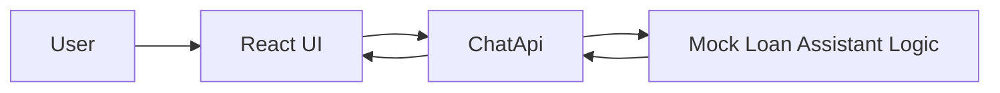

# Phase 1: Mock Chat Backend

## Scope

Create a local backend contract and a frontend chat shell without relying on Azure OpenAI or retrieval.

## Architecture Diagram

## Request Flow

1. User opens the React app.
2. The UI renders a chat shell and starter prompts.
3. The backend exposes `GET /api/health`, `GET /api/chat/prompts`, and `POST /api/chat`.
4. The backend returns deterministic mock responses for loan-related prompts.

## Tradeoffs

### What we gained

- Fast progress without waiting on Azure setup
- Stable request and response contract early
- Easy local testing for chat layout and API shape

### What we accepted

- Responses are canned and not intelligent
- The frontend experience is only partially realistic until real API calls are in place
- No document grounding or source attribution yet

### Why this was the right phase boundary

Separating mock backend setup from Azure integration reduced risk. We were able to define the contract and shape the user experience before introducing external dependencies, secrets, network calls, or model behavior.

## Exit Criteria

- Backend exposes mock chat endpoints
- Frontend chat shell exists
- The app is ready for real frontend-to-backend wiring
