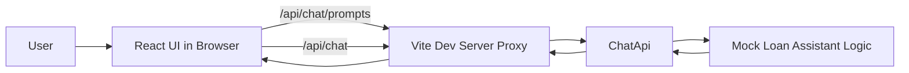

# Phase 2: Connect React UI To API

## Scope

Replace frontend-local mock replies with real calls to the local `ChatApi` while preserving the same chat experience.

## Architecture Diagram

## Request Flow

1. The React app loads starter prompts from `GET /api/chat/prompts`.
2. The user submits a message from the chat composer.
3. The browser sends `POST /api/chat` through the Vite proxy.
4. The backend returns a mock assistant response.
5. The UI appends the assistant reply and handles loading or error states.

## Tradeoffs

### What we gained

- Real integration path between frontend and backend
- Early validation of the API contract under browser conditions
- Cleaner transition to Azure OpenAI because the UI no longer owns reply generation

### What we accepted

- Local development depends on the backend being started separately
- Browser-only runtime issues can still happen even if frontend build passes
- We are still using mock backend logic, so response quality is intentionally limited

### Why this was the right phase boundary

This phase moved response ownership to the backend without changing the contract again. That keeps the frontend stable and makes phase 3 mostly a backend implementation swap instead of another cross-stack redesign.

## Exit Criteria

- React uses the backend for prompts and chat responses
- Loading and error states are visible in the UI
- Local proxy configuration supports browser development
