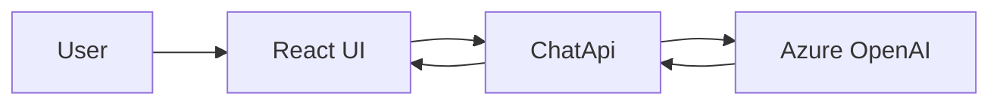

# Phase 3: Plug In Azure OpenAI

## Scope

Replace mock response generation in the backend with Azure OpenAI chat completions.

## Architecture Diagram

## Request Flow

1. The browser sends `POST /api/chat` to `ChatApi`.
2. `ChatApi` resolves Azure OpenAI settings from configuration.
3. If settings are valid, the backend sends a system prompt plus user message to the configured Azure OpenAI deployment.
4. The model response is mapped back into the existing `ChatResponse` contract.
5. If configuration is missing or the request fails, the backend can return a mock fallback response instead.

## Tradeoffs

### What we gained

- Real model-generated responses
- A backend integration point that keeps the React contract stable
- A clear boundary between API surface, config, and model invocation logic

### What we accepted

- Configuration and secret management overhead
- Latency and external service dependency
- Need for prompt tuning and safety controls
- The app still carries fallback logic for resilience during setup, which adds a little extra branching

### Why this phase boundary works

The frontend already speaks to `/api/chat`, so phase 3 only changes backend internals. That means we can iterate on Azure OpenAI configuration, prompting, and failure handling without forcing another UI rewrite.

## Exit Criteria

- Backend uses Azure OpenAI for chat replies
- Config is environment-driven
- Frontend contract remains unchanged
- Real resource credentials are tested successfully in a local or shared environment
