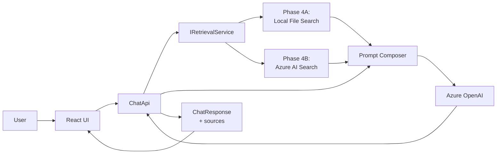

# Phase 4: Add Retrieval / RAG

## Scope

Ground model responses in loan-specific data and documents so answers are domain-specific
rather than generic model behavior.

## Architecture Diagram



## Sub-phases

### Phase 4A: Local File Retrieval (current)

Zero-infrastructure retrieval over markdown knowledge documents.
Proves the prompt composition pattern and the service abstraction before adding cloud search.

Deliverables:

- `IRetrievalService` interface and `RetrievalResult` model in `src/RetrievalService/`
- `LocalFileRetriever` implementing keyword search over `data/loan-kb/*.md`
- Prompt composer that prepends retrieved snippets to the system prompt
- `MaxRetrievalTokens` budget to prevent context overflow
- `sources[]` field added to the API response
- Response tags: `"with-retrieval"` and `"retrieval-miss"` for observability

### Phase 4B: Azure AI Search

Production-grade hybrid retrieval replacing the local file backend.

Deliverables:

- `AzureSearchRetriever` implementing `IRetrievalService`
- Azure AI Search index and indexing pipeline for `data/loan-kb/`
- Hybrid query (BM25 + vector) using `text-embedding-ada-002`
- DI registration swap in `Program.cs` — no other code changes
- Latency SLO established against Phase 4A baseline

## Key Architectural Decisions

See [ADR-0002](adr-0002-retrieval-strategy-phase-4.md) for the full decision record.

Summary:

- Retrieval backend: local files (4A) → Azure AI Search (4B), both behind `IRetrievalService`
- Context injection: system prompt enrichment (4A), with structure ready for separate context message (4B)
- Citations: structured `sources[]` from the retrieval layer, not LLM-generated
- Chunking: paragraph/section boundaries at `##` headers in markdown documents
- Relevance: score threshold; `"retrieval-miss"` tag when nothing clears the threshold

For backend comparison and context injection strategy details see
[tradeoff-retrieval-backends.md](tradeoff-retrieval-backends.md).

## Token Budget

Retrieved context consumes tokens from the same context window as the model's output.

- `MaxOutputTokens` (existing in `AzureOpenAiOptions`) governs model response length
- `MaxRetrievalTokens` (new, in `RetrievalOptions`) caps the total snippet content added to the prompt
- Snippets are included in descending relevance score order and truncated to fit the budget
- If no snippets fit, the model answers from training data alone and the response is tagged `"retrieval-miss"`

## Observability via Response Tags

| Tag | Meaning |
|---|---|
| `"with-retrieval"` | At least one snippet exceeded the relevance threshold |
| `"retrieval-miss"` | No snippets cleared the threshold |
| `"retrieval-error"` | Retrieval call failed; fallback to model-only |

## API Contract Extension

The `sources[]` field is added to the response. It is empty when no retrieval occurred.
This is an additive change — existing clients that do not read `sources` are unaffected.

```json
{
  "id": "abc123",
  "role": "assistant",
  "message": "For an FHA loan, most lenders require a minimum credit score of 580...",
  "timestamp": "2026-03-22T12:00:00Z",
  "tags": ["azure-openai", "with-retrieval", "step-4a"],
  "sources": [
    {
      "sourceName": "FHA Loan Credit Requirements",
      "snippet": "Borrowers with a score of 580 or higher qualify for a 3.5% down payment...",
      "relevance": 0.82
    }
  ]
}
```

## Files Involved

Phase 4A:

- `src/RetrievalService/IRetrievalService.cs`
- `src/RetrievalService/RetrievalResult.cs`
- `src/RetrievalService/LocalFileRetriever.cs`
- `src/RetrievalService/RetrievalOptions.cs`
- `data/loan-kb/*.md`
- `src/ChatApi/Services/AzureOpenAiChatResponder.cs` (inject and call retriever)
- `src/ChatApi/Services/ChatResult.cs` (add sources)
- `src/ChatApi/Program.cs` (register IRetrievalService)
- `src/frontend-react/src/App.tsx` (render sources)
- `docs/phase-4-add-retrieval-rag.md`

Phase 4B (additions):

- `src/RetrievalService/AzureSearchRetriever.cs`
- `src/RetrievalService/Configuration/AzureSearchOptions.cs`
- `src/ChatApi/Program.cs` (swap DI registration)

## Exit Criteria

Phase 4A:

- Retrieved context is included in at least one loan-domain prompt
- Response tags distinguish retrieval hits from misses
- `sources[]` is present in the API response when retrieval succeeds
- Token budget enforcement prevents context overflow

Phase 4B:

- Azure AI Search index is live and indexed from `data/loan-kb/`
- Hybrid query outperforms keyword search on semantic test questions
- Latency regression vs. Phase 4A is within the defined SLO

## Notes

- Do not start Phase 4A until Phase 3 (Azure OpenAI) is verified end-to-end at runtime
- The `IRetrievalService` interface must use `async Task` signatures from day one, even though local file search does not need them — Phase 4B backends are I/O-bound
- Single-turn retrieval is sufficient for 4A; multi-turn query reformulation (using conversation history to rewrite the retrieval query) is a Phase 4B or Phase 5 concern
