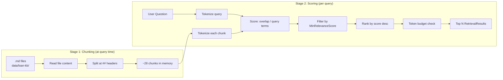
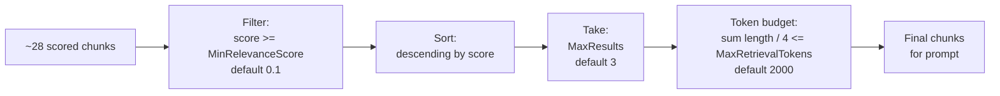

# Retrieval: How Files Are Chunked and Queries Are Scored

Explains exactly how `LocalFileRetriever` turns knowledge base documents into retrievable
chunks and how a user question is compared against those chunks to find relevant content.

---

## Overview: Two Stages



> **Note:** Phase 4A chunks files on every query — there is no persistent index.
> Phase 4B replaces this with a pre-built Azure AI Search index.

---

## Part 1: How Files Are Chunked

### Source files

```
data/loan-kb/
  fha-loan-requirements.md
  conventional-loan-requirements.md
  pre-approval-process.md
  closing-costs.md
  credit-score-guidelines.md
```

Each file is structured with markdown section headers. Only `##` (double hash) headers
create chunk boundaries. The top-level `#` title is ignored.

### Chunking algorithm

The algorithm walks every line of the file with two state variables:

```
currentHeader  — the heading of the section currently being collected
currentLines   — lines of text collected under that heading
```

```mermaid
flowchart TD
    Start[Start reading file]
    NextLine{Next line?}
    IsH2{Starts with "## "?}
    HasPrev{currentHeader\nnot null?}
    EmitChunk[Emit chunk:\nsourceName — currentHeader\n+ collected lines]
    SetHeader[currentHeader = new header\ncurrentLines = empty]
    AppendLine[Append line to currentLines]
    EndFile{End of file?}
    EmitLast[Emit final chunk]
    Done[Done]

    Start --> NextLine
    NextLine --> IsH2
    IsH2 -->|Yes| HasPrev
    HasPrev -->|Yes| EmitChunk --> SetHeader --> NextLine
    HasPrev -->|No| SetHeader --> NextLine
    IsH2 -->|No| AppendLine --> NextLine
    NextLine --> EndFile
    EndFile -->|Yes| EmitLast --> Done
```

### Concrete example: `fha-loan-requirements.md`

```
# FHA Loan Requirements          ← single # — ignored (before first ##)

## Credit Score Requirements     ← currentHeader = "Credit Score Requirements"
FHA loans require a minimum...       currentLines collecting...
Borrowers with credit scores...

## Down Payment Requirements     ← emit Chunk 1, start Chunk 2
The minimum down payment...

## Debt-to-Income Ratio          ← emit Chunk 2, start Chunk 3
FHA guidelines generally allow...

## Loan Limits                   ← emit Chunk 3, start Chunk 4
## Mortgage Insurance Premium    ← emit Chunk 4, start Chunk 5
## Property Requirements         ← emit Chunk 5, start Chunk 6
                                 ← end of file: emit Chunk 6
```

### Output chunks from one file

The filename `fha-loan-requirements` becomes `fha loan requirements`
(dashes replaced with spaces) to form a readable source name.

| Chunk | SourceName | Content |
|---|---|---|
| 1 | `fha loan requirements — Credit Score Requirements` | FHA requires 580 min score... |
| 2 | `fha loan requirements — Down Payment Requirements` | 3.5% down with 580+ score... |
| 3 | `fha loan requirements — Debt-to-Income Ratio` | Max front-end DTI of 31%... |
| 4 | `fha loan requirements — Loan Limits` | $498,257 standard limit... |
| 5 | `fha loan requirements — Mortgage Insurance Premium` | Upfront MIP of 1.75%... |
| 6 | `fha loan requirements — Property Requirements` | Must meet FHA standards... |

Across all 5 files (~5–6 sections each), roughly **28 chunks** are held in memory
and scored on every query.

---

## Part 2: How the Query is Tokenized

The same `Tokenize()` function is applied to both the user's question and each chunk.
This ensures both are in the same normalized form before comparison.

### Tokenize steps

```
Input: "What credit score do I need for an FHA loan?"

Step 1 — lowercase
  "what credit score do i need for an fha loan?"

Step 2 — split on whitespace and punctuation
  [ "what", "credit", "score", "do", "i", "need", "for", "an", "fha", "loan" ]

Step 3 — drop tokens shorter than 3 characters
  "i" → dropped
  [ "what", "credit", "score", "do", "need", "for", "an", "fha", "loan" ]

Step 4 — drop stop words
  "what" → DROPPED   (in stop word list)
  "credit" → KEPT
  "score" → KEPT
  "do" → DROPPED
  "need" → KEPT
  "for" → DROPPED
  "an" → DROPPED
  "fha" → KEPT
  "loan" → KEPT

Step 5 — deduplicate into a HashSet
  queryTerms = { "credit", "score", "need", "fha", "loan" }   ← 5 meaningful terms
```

### Stop words

Stop words are common English words that carry no retrieval signal — filtering them
prevents high-frequency words from inflating scores artificially.

```
a, an, the, and, or, for, are, but, not, you, all, can, was, one, our, out,
get, has, how, its, may, new, now, see, who, did, what, this, that, with,
have, from, they, will, been, when, were, your, each, she, use, does, their,
which, there, about, would, make, like, into, than, then, some, also, more,
other, these, those, such, most, do, is, if, of, to, in, it, be, as, at,
so, we, he, by, on
```

---

## Part 3: How Query is Compared to Each Chunk

### Scoring formula

```
score = overlapping query terms in chunk / total query terms
```

This answers: *"what fraction of what the user asked about appears in this chunk?"*

Score range: `0.0` (no overlap) to `1.0` (every query term found in the chunk).

### Worked example

**Query terms:** `{ "credit", "score", "need", "fha", "loan" }` — 5 terms

**Chunk 1:** `fha loan requirements — Credit Score Requirements`

```
Chunk tokens include: { "fha", "loans", "require", "minimum", "credit", "score",
                        "580", "qualify", "down", "payment", "borrowers", "scores",
                        "500", "579", "eligible", "financing", "lenders", ... }

"credit" in chunk? YES  ✓
"score"  in chunk? YES  ✓   (chunk has "score" as a standalone token)
"need"   in chunk? NO   ✗
"fha"    in chunk? YES  ✓
"loan"   in chunk? YES  ✓   (chunk has "loan" in "FHA financing" etc.)

overlap = 4
score   = 4 / 5 = 0.80
```

### Scores across all chunks for this query

```
Query: "What credit score do I need for an FHA loan?"
queryTerms: { "credit", "score", "need", "fha", "loan" }

fha loan requirements — Credit Score Requirements        0.80  ← top
credit score guidelines — Credit Score Ranges            0.80  ← top
fha loan requirements — Down Payment Requirements        0.40
conventional loan requirements — Credit Score Reqs       0.40
fha loan requirements — Debt-to-Income Ratio             0.20
pre approval process — Documents Required                0.20
fha loan requirements — Mortgage Insurance Premium       0.20
closing costs — What Are Closing Costs                   0.00  ← filtered out
closing costs — Lender Fees                              0.00  ← filtered out
```

---

## Part 4: Filter, Rank, and Token Budget

After scoring, three filters apply in sequence:



### Filter: MinRelevanceScore

Chunks scoring below the threshold (default `0.1`) are dropped entirely.
A score of `0.1` means at least 1 in 10 query terms appeared in the chunk.
Chunks with zero overlap always score `0.0` and are always dropped.

### Sort and Take

Survivors are sorted highest score first. The top `MaxResults` (default 3) are kept.

### Token budget

Each surviving chunk is checked against the remaining token budget before inclusion:

```
Chunk 1: length = 620 chars → estimatedTokens = 620 / 4 = 155   tokensUsed = 155  ✓
Chunk 2: length = 740 chars → estimatedTokens = 740 / 4 = 185   tokensUsed = 340  ✓
Chunk 3: length = 560 chars → estimatedTokens = 560 / 4 = 140   tokensUsed = 480  ✓

All 3 fit within the 2000-token budget → all included
```

If a chunk would overflow the budget, it is dropped and iteration stops.
Lower-scoring chunks are never included at the expense of higher-scoring ones.

The token estimate (`length / 4`) is an approximation. One token is roughly 4 characters
for English prose. This avoids a tokenizer dependency in Phase 4A.

---

## Part 5: What the Scoring Cannot Do

The keyword overlap formula only matches exact words. It fails on semantic similarity —
when the user's words and the document's words mean the same thing but are different words.

| Query | Document phrase | Match? | Why |
|---|---|---|---|
| "credit score for FHA" | "minimum credit score of 580" | YES | exact word overlap |
| "how much cash upfront" | "closing costs — 2% to 5%" | NO | "cash"/"upfront" not in document |
| "can I get a loan with bad credit" | "scores below 500 not eligible" | PARTIAL | "loan"/"credit" match, "bad" does not |
| "what income do I need" | "debt-to-income ratio limits" | PARTIAL | "income" matches, "need" is stop word |

These gaps are exactly what Phase 4B (Azure AI Search with vector/semantic retrieval) addresses.
A vector model understands that "cash upfront" and "closing costs" refer to the same concept
even without shared words.

---

## Configuration Reference

All thresholds are configurable in `appsettings.json` under the `Retrieval` section:

| Setting | Default | Effect |
|---|---|---|
| `KnowledgeBasePath` | `"data/loan-kb"` | Directory containing `.md` files |
| `MaxResults` | `3` | Maximum chunks returned after scoring |
| `MaxRetrievalTokens` | `2000` | Token budget for all chunks combined |
| `MinRelevanceScore` | `0.1` | Minimum score to pass the filter |

Raising `MinRelevanceScore` increases precision (fewer but more relevant chunks).
Lowering it increases recall (more chunks, potentially noisier context).

---

## Files Involved

| File | Role |
|---|---|
| [src/RetrievalService/LocalFileRetriever.cs](../../src/RetrievalService/LocalFileRetriever.cs) | Chunking and scoring implementation |
| [src/RetrievalService/RetrievalOptions.cs](../../src/RetrievalService/RetrievalOptions.cs) | Configuration class |
| [src/RetrievalService/RetrievalResult.cs](../../src/RetrievalService/RetrievalResult.cs) | Output model: SourceName, Snippet, Relevance |
| [src/RetrievalService/IRetrievalService.cs](../../src/RetrievalService/IRetrievalService.cs) | Interface contract |
| [data/loan-kb/](../../data/loan-kb/) | Knowledge base documents |
| [src/ChatApi/appsettings.json](../../src/ChatApi/appsettings.json) | Retrieval configuration values |
