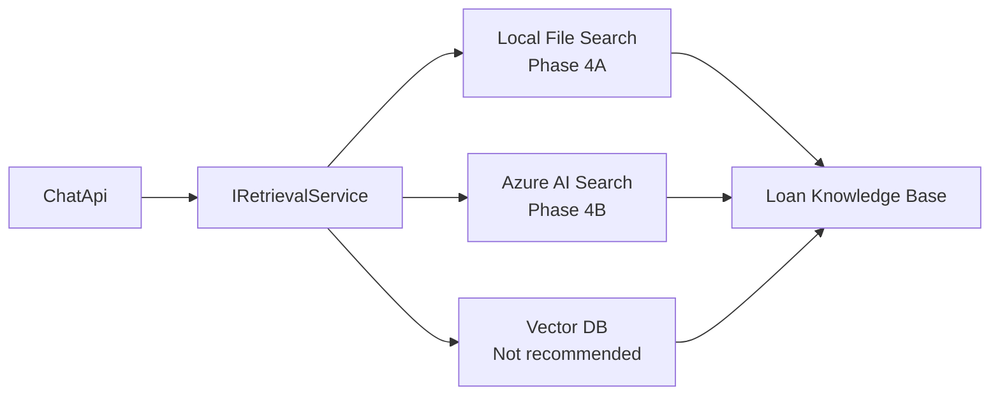
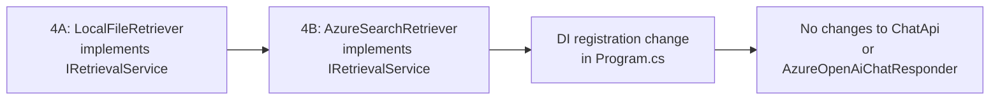

# Tradeoff: Retrieval Backends for Phase 4 RAG

## Executive Summary

Three retrieval backends are viable for this project at different stages.
The right choice is not fixed — it depends on the delivery phase and quality target.

- **Local file search** is the right backend for Phase 4A: zero infrastructure, fast delivery
- **Azure AI Search** is the right backend for Phase 4B: production quality, Azure-native
- **Vector databases** are not recommended for this project at any stage

All three share the same `IRetrievalService` interface, so ChatApi is never aware of which is running.

## Architecture Overview



## How Each Backend Works

### Local File Search (Phase 4A)

- Knowledge documents are `.md` files in `data/loan-kb/`
- Documents are chunked at `##` section boundaries
- A user question is matched against chunk text using keyword overlap scoring
- No embeddings, no index, no external service
- Snippets above a relevance threshold are included in the prompt

### Azure AI Search (Phase 4B)

- Knowledge documents are indexed in an Azure AI Search resource
- Queries use hybrid retrieval: BM25 (lexical) + vector (semantic via embeddings)
- Results include a relevance score and document metadata (title, URL, section)
- Requires an indexing pipeline to keep documents current
- An embedding model (e.g., `text-embedding-ada-002`) is needed for semantic search

### Vector Database

- Documents are embedded and stored in a purpose-built vector store (Qdrant, Pinecone, Weaviate)
- Queries use cosine or dot-product similarity against the embedded question
- Good for semantic recall, not recommended here due to platform mismatch with Azure

## Comparison Table

| Dimension | Local File Search | Azure AI Search | Vector DB |
|---|---|---|---|
| Infrastructure required | None | Azure resource + index | Hosted or self-managed |
| Query type | Keyword only | Hybrid (BM25 + vector) | Semantic (vector) |
| Recall for semantic queries | Low | High | High |
| Precision | Medium | High | Medium-High |
| Setup effort | Minutes | Hours | Days |
| Operational cost | Zero | ~$0.25 per 1K queries | Variable |
| Latency | Sub-millisecond | 100–300 ms | 50–200 ms |
| Document freshness | Edit files in repo | Re-index pipeline | Re-embed pipeline |
| Azure platform fit | N/A | Strong (ADR-0001 aligned) | Weak |
| Phase | 4A | 4B | Not planned |

## Context Injection Strategies

Once content is retrieved, it must enter the LLM prompt. Two patterns are relevant:

### System Prompt Enrichment (Phase 4A default)

```
System: "You are a loan assistant. Use the following context to answer accurately:

[Retrieved: FHA Loan Credit Requirements]
Borrowers with a credit score of 580 or higher can qualify for a 3.5% down payment...

[Retrieved: FHA Loan Limits 2026]
Standard loan limits are $498,257 for single-family properties in most counties...

Answer based on this context. If the context does not address the question, say so."

User: "What credit score do I need for an FHA loan?"
```

Pros: Simple, model clearly sees the context boundary
Cons: Long system prompts reduce effective output budget

### Separate Context Message (Phase 4B option)

```
System:  "You are a loan assistant. Use the provided context to answer accurately."
Context: "[Context block as a separate user message]"
User:    "What credit score do I need for an FHA loan?"
```

Pros: Cleaner separation, works better with longer retrieved sets
Cons: Slightly more complex prompt construction code

The code is structured so switching from one pattern to the other is a single change in the prompt composer, not a change to the retrieval service or the API contract.

## Citation Strategy Tradeoffs

| Approach | Reliability | UX | Implementation Effort |
|---|---|---|---|
| LLM-generated citations | Low — model may hallucinate source names | Good prose integration | Low |
| Structured metadata from retrieval | High — ground truth from the code | Rendered as UI chips/links | Medium |
| Both — metadata + prompt engineering | High — reliable data, good prose | Best overall | Medium-High |

**Recommended approach:** Structured metadata as the foundation. The retrieval service returns `SourceName`, `Snippet`, and `Relevance` for each result. These are serialized into the API response as `sources[]`. The UI renders them. Prompt engineering to reference sources by name in prose can be added later without changing the API contract.

## What We Accept by Starting with Local Files

Phase 4A intentionally accepts lower retrieval quality in exchange for:

- No infrastructure setup delay
- Immediate proof of the prompt composition pattern
- Observable quality signals via response tags before the retrieval backend is production-grade
- Human-auditable knowledge base that can be reviewed alongside the code

The knowledge base in `data/loan-kb/` is small enough that low-recall keyword search is
acceptable at this stage. A question like "What do I need for pre-approval?" will match
a document that uses the same words. A question like "How much cash do I need upfront?"
requires semantic search to reliably match "Closing Cost Breakdown" — that is a Phase 4B win.

## Risks and Mitigations

| Risk | Impact | Mitigation |
|---|---|---|
| Context window overflow | Model silently drops content | `MaxRetrievalTokens` budget enforced before prompt assembly |
| Low retrieval recall in 4A | Unhelpful "retrieval-miss" responses | Curate knowledge base to use terms users actually ask with |
| Citation hallucination | Wrong source names in model prose | Use structured metadata, not model-generated citations |
| Index staleness in 4B | Outdated content in answers | Build indexing pipeline into document update workflow |
| Latency regression in 4B | Slower response times | Measure baseline in 4A; set SLO before 4B goes live |

## Migration Path: 4A to 4B



The abstraction is the asset. The only change when upgrading from 4A to 4B is the DI
registration in `Program.cs` and any additional configuration for the Azure AI Search
connection. The prompt composition logic, the API contract, and the UI are unchanged.

## Current Recommendation

For Phase 4A:

- Use local file keyword search in `data/loan-kb/`
- Chunk at `##` section boundaries
- Inject context via system prompt enrichment
- Return `sources[]` as structured metadata in the API response
- Tag responses with `"with-retrieval"` or `"retrieval-miss"` for observability

For Phase 4B:

- Provision an Azure AI Search resource
- Build an indexing pipeline for `data/loan-kb/` (and future document sources)
- Swap `LocalFileRetriever` for `AzureSearchRetriever` in DI
- Enable hybrid (BM25 + vector) queries with `text-embedding-ada-002`
- Revisit context injection strategy based on real query volume and latency data
