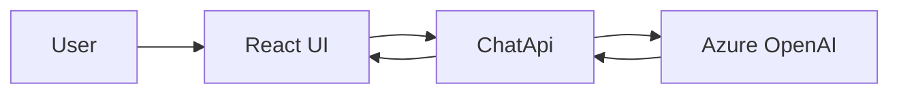

# Phase 3: Plug In Azure OpenAI

## Scope

Replace mock response generation in the backend with Azure OpenAI chat completions.

## Architecture Diagram

## Planned Tradeoffs

### What we expect to gain

- Real model-generated responses
- More flexible and natural conversational behavior
- A production-like chat pipeline

### What we expect to accept

- Configuration and secret management overhead
- Latency and external service dependency
- Need for prompt tuning and safety controls

## Exit Criteria

- Backend uses Azure OpenAI for chat replies
- Config is environment-driven
- Frontend contract remains unchanged
