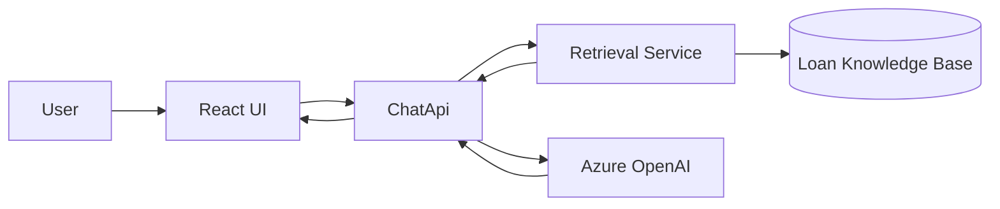

# Phase 4: Add Retrieval / RAG

## Scope

Ground model responses in loan-specific data and documents.

## Architecture Diagram

## Planned Tradeoffs

### What we expect to gain

- More grounded and domain-specific answers
- Better trustworthiness than model-only chat
- A path to citations and source-aware responses

### What we expect to accept

- More system complexity
- More moving parts to test and observe
- Retrieval quality becomes a major factor in answer quality

## Exit Criteria

- Retrieved context is added to prompts
- Responses can reference domain content
- The system is ready for evaluation of grounding quality
