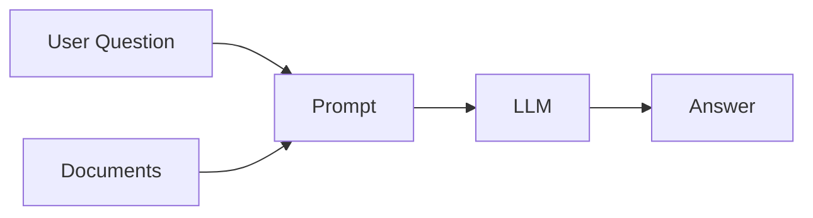
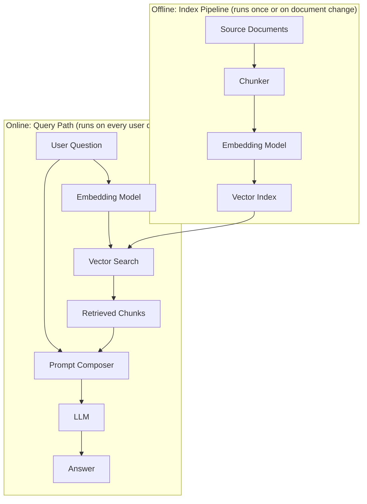
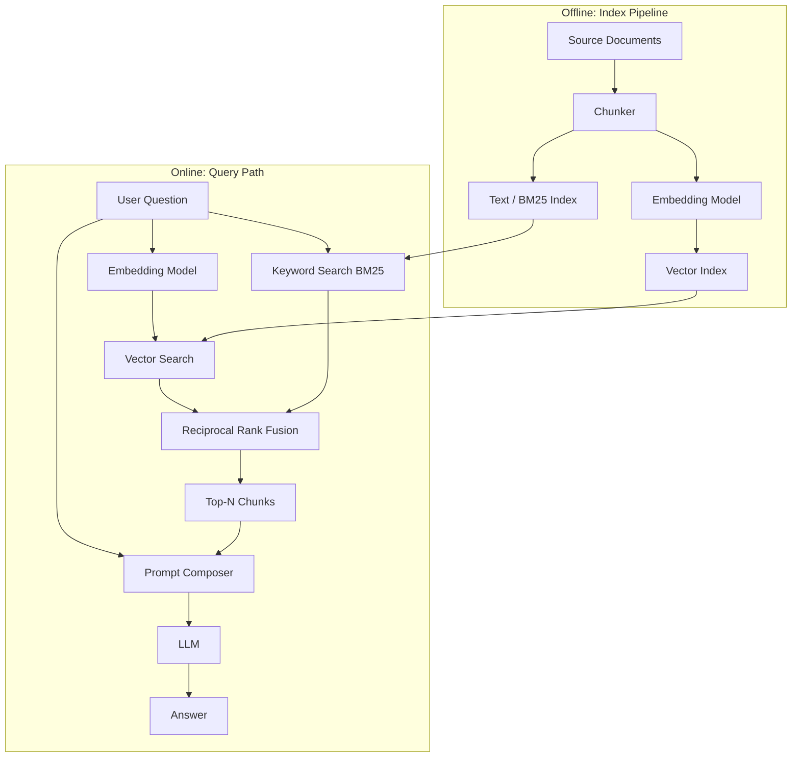
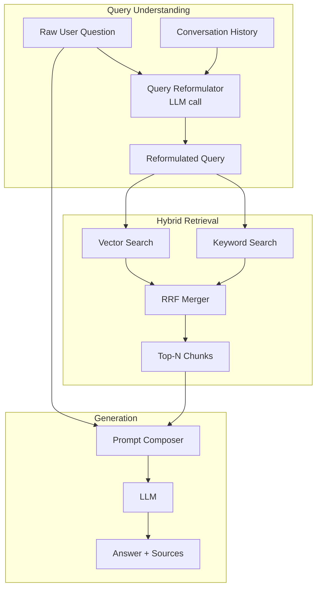
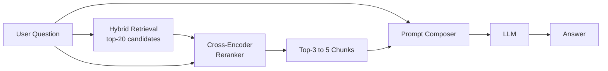
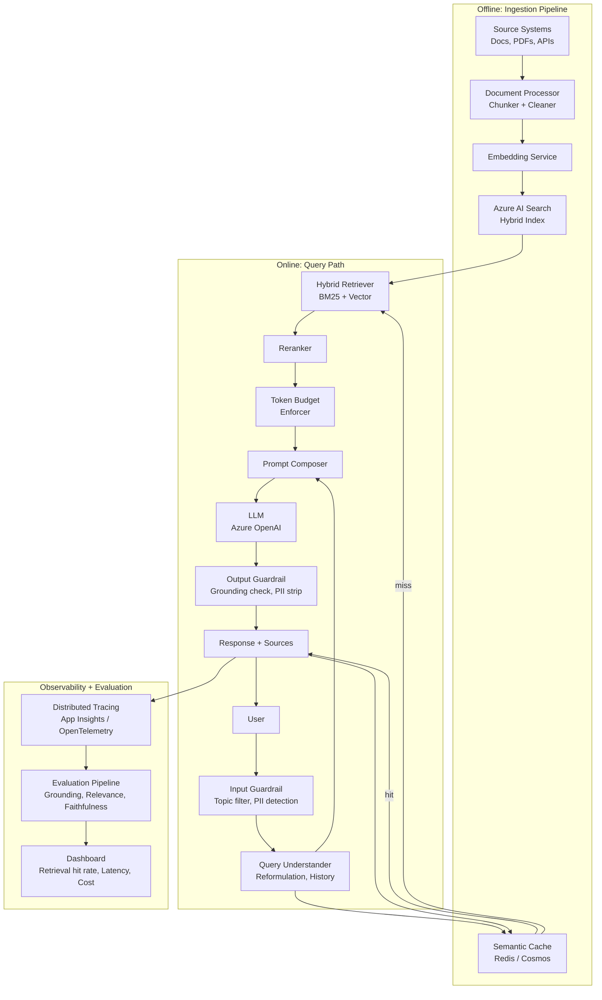
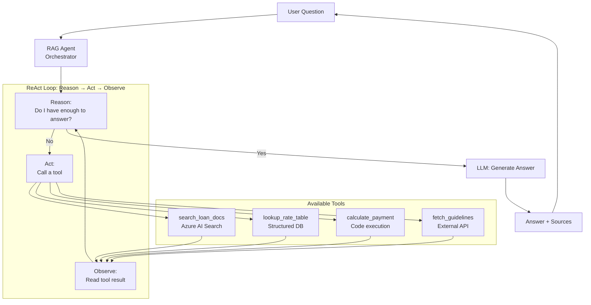
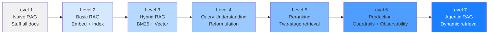

# RAG Architecture: Simple to Production

A progressive walkthrough of Retrieval-Augmented Generation (RAG) architecture,
from the simplest possible pattern to a production-grade system.

---

## Level 1: Naive RAG

The simplest possible RAG. No preprocessing pipeline. Documents are read at query time,
stuffed into the prompt, and sent to the model.



**What it does:**
- Load all documents into the prompt every time
- No search, no ranking, no preprocessing

**What it accepts:**
- Context window fills up fast — works only for tiny document sets
- No relevance filtering — model gets everything, relevant or not
- Expensive: re-reads all documents on every query

**When it is valid:**
- Prototyping with 3–5 short documents
- Verifying that the model can answer from given context before adding retrieval

---

## Level 2: Basic RAG — Offline + Online Separation

The foundational pattern. Split into two distinct phases:
**offline** (index the knowledge base once) and **online** (retrieve at query time).



**What is added vs Level 1:**
- Documents are chunked and embedded once, stored in a vector index
- At query time only the relevant chunks are retrieved — not everything
- The same embedding model is used for both documents and the query

**What it accepts:**
- Retrieval is based on embedding similarity only — no keyword matching
- No handling of short queries, typos, or vocabulary mismatch
- No reranking — top-N by vector distance may not be the most relevant N

**When to use:**
- First real RAG implementation
- Small-to-medium corpus, single language, single source
- This is the target for Phase 4B of this project

---

## Level 3: Hybrid RAG — BM25 + Vector Search

Combines keyword search (BM25) and vector search. Each produces a ranked list;
Reciprocal Rank Fusion (RRF) merges them into a single ranking.



**What is added vs Level 2:**
- BM25 catches exact keyword matches that vector search misses
- Vector search catches semantic matches that keyword search misses
- RRF merges both ranked lists — a chunk that ranks high in both gets surfaced reliably
- Azure AI Search implements this natively — no custom code needed

**What it accepts:**
- Two indexes to maintain (text and vector) — Azure AI Search manages both as one resource
- Slightly higher query latency than vector-only

**When to use:**
- Users don't use exact document vocabulary in their questions
- Domain has both technical terms (BM25 wins) and natural language queries (vector wins)
- This is the right default for production loan domain search

---

## Level 4: RAG with Query Understanding

Real users ask vague, multi-part, or conversational questions. This level adds a
preprocessing step to improve the query before retrieval.



**Query reformulation techniques:**

| Technique | What it does | Example |
|---|---|---|
| **Standalone query** | Rewrites a follow-up using conversation history | "what about the down payment?" → "what is the FHA down payment requirement?" |
| **HyDE** | Generates a hypothetical answer, embeds that instead of the question | Improves vector recall for vague queries |
| **Multi-query** | Generates N variants of the query, retrieves for each, deduplicates | Better recall for ambiguous questions |
| **Step-back** | Asks a more general version first, retrieves broader context | "FHA loan for self-employed?" → first retrieve "FHA general requirements" |

**What is added vs Level 3:**
- Multi-turn conversations produce better retrieval (history used to rewrite query)
- Vague or short queries return better results
- HyDE and multi-query improve recall at the cost of extra LLM calls

**When to use:**
- Application has a chat interface with conversation history (this project does)
- Users ask follow-up questions that reference previous turns
- Retrieval miss rate in Level 3 is unacceptably high

---

## Level 5: RAG with Reranking

Initial retrieval (Level 3/4) returns top-20–50 candidates efficiently.
A reranker then applies a heavier model to re-score those candidates and select the best 3–5.



**Why two-stage retrieval:**

```
Stage 1 — Recall (fast, approximate):
  Bi-encoder: embed query once, compare against all stored vectors
  Fast because document vectors are pre-computed
  Returns top-20 to 50 candidates

Stage 2 — Precision (slower, exact):
  Cross-encoder: score (query, chunk) together as a pair
  More accurate — sees both query and chunk in full context
  Applied only to the 20–50 candidates, not the full index
  Returns top-3 to 5 for the prompt
```

**Reranker options:**
- `cross-encoder/ms-marco-MiniLM-L-6-v2` — open source, fast
- Cohere Rerank API — managed, high quality, available on Azure
- Azure AI Search semantic ranker — built-in, no extra service needed

**What is added vs Level 4:**
- Precision of final chunks is significantly better
- Reduces the chance that a topically adjacent but irrelevant chunk reaches the model
- Token budget is used more efficiently — fewer but better chunks

**When to use:**
- Precision of answers matters more than latency (financial, legal, medical domains)
- Users are asking specific factual questions where the wrong chunk causes a wrong answer
- Recommended for a production loan copilot

---

## Level 6: Production RAG — Full System

All previous levels combined with the operational concerns needed for production:
caching, observability, guardrails, evaluation, and multi-source retrieval.



**What is added vs Level 5:**

| Component | Purpose |
|---|---|
| **Input guardrail** | Reject off-topic, harmful, or PII-containing queries before they hit retrieval |
| **Semantic cache** | Return cached answers for near-duplicate questions — reduces cost and latency |
| **Multi-source retrieval** | Query structured data (SQL), unstructured docs, and APIs in parallel |
| **Token budget enforcer** | Hard cap on retrieved content before prompt assembly — prevents overflow |
| **Output guardrail** | Check answer is grounded in retrieved context, strip any PII in output |
| **Distributed tracing** | Trace every query end-to-end — retrieval latency, tokens used, which chunks were returned |
| **Evaluation pipeline** | Automated scoring of grounding, relevance, and faithfulness at scale |

---

## Level 7: Agentic RAG

The retrieval strategy itself becomes dynamic. An agent decides whether to retrieve,
which source to query, whether to do multi-hop retrieval, and when it has enough information.



**What changes vs Level 6:**
- Retrieval is not a fixed step — the agent decides when and what to retrieve
- Multi-hop: agent can retrieve once, read the result, then retrieve again based on what it found
- Can combine retrieval with calculation, database lookup, and API calls in one response
- The LLM is both the orchestrator and the generator

**Example multi-hop:**
```
User: "Can I afford a $450K home if I make $95K/year and have a 680 credit score?"

Agent turn 1: search_loan_docs("DTI ratio requirements conventional loan")
  → "Standard DTI limit is 43%, some lenders allow 50%"

Agent turn 2: calculate_payment(price=450000, down=0.10, rate=0.0725, term=30)
  → "Monthly payment: $2,760"

Agent turn 3: calculate_dti(monthly_debt=2760, gross_monthly=7917)
  → "DTI: 34.9% — within standard limits"

Agent: I have enough information → generate final answer with all sources
```

**When to use:**
- Questions require combining multiple data sources
- Answers require computation alongside retrieval
- Complex multi-part questions that a single retrieval pass cannot answer

**Tradeoffs:**
- Higher latency — multiple LLM + retrieval round trips
- Harder to trace and debug
- Non-deterministic — agent may take different paths for the same question

---

## Architecture Progression Summary



| Level | Complexity | Retrieval Quality | Cost | Right When |
|---|---|---|---|---|
| 1 Naive | Minimal | Very low | High (all docs every time) | Prototyping only |
| 2 Basic | Low | Medium | Low | First real RAG, small corpus |
| 3 Hybrid | Low-Medium | High | Low | Prod with vocabulary mismatch |
| 4 Query Understanding | Medium | High | Medium (extra LLM call) | Multi-turn chat, vague queries |
| 5 Reranking | Medium | Very high | Medium | Financial, legal, medical domains |
| 6 Production | High | Very high | Optimised via cache | Live product with real users |
| 7 Agentic | Very high | Adaptive | High (multi-hop LLM) | Complex multi-source questions |

---

## Where This Project Is and Where It Is Heading

```
Phase 4A (now):      Level 2 — Basic RAG with local file keyword search
                     (no embeddings, but the offline/online split is in place)

Phase 4B (next):     Level 3 — Hybrid RAG with Azure AI Search

Future improvement:  Level 4 — Query reformulation using conversation history
                     Level 5 — Cohere Rerank or Azure semantic ranker
                     Level 6 — Add semantic cache, guardrails, tracing, eval pipeline
                     Level 7 — Agent orchestration when multi-source answers are needed
```

Each level is additive. The `IRetrievalService` abstraction and the prompt composition
pattern established in Phase 4A remain valid at every level — only the internals evolve.
