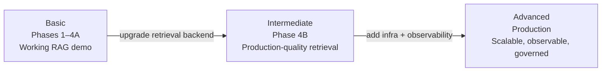

# Tradeoffs by Project Phase: Basic → Intermediate → Advanced

Documents the deliberate tradeoffs accepted at each phase of the Azure AI Loan Copilot.
Each phase builds on the previous without requiring structural rework.

---

## Phase Map



---

## Basic — Phases 1 through 4A

**Status: current**

**Goal:** A working end-to-end loan copilot with grounded answers and no external
infrastructure beyond Azure OpenAI.

### What is in place

| Capability | Implementation |
|---|---|
| Chat API | ASP.NET Core minimal API, `POST /api/chat` |
| LLM | Azure OpenAI via `Azure.AI.OpenAI` SDK |
| Retrieval | Local `.md` files, keyword search, section chunking |
| Knowledge base | 5 markdown files in `data/loan-kb/` |
| Context injection | System prompt enrichment |
| Citations | Structured `sources[]` in API response |
| Observability | Response tags: `with-retrieval`, `retrieval-miss`, `retrieval-error` |
| Frontend | React + TypeScript, displays chat messages |
| Fallback | Mock loan assistant when Azure config is missing |

### Tradeoffs accepted in Basic

| Area | What we accepted | Why |
|---|---|---|
| **Retrieval quality** | Keyword overlap only — misses semantic queries ("cash upfront" ≠ "closing costs") | Zero infrastructure; proves the prompt composition pattern |
| **Retrieval speed** | Files read and chunks tokenized on every query | Acceptable for demo scale; pre-computation deferred to keep code simple |
| **HTTP client** | `AzureOpenAIClient` created per request | Known issue; not fixed until Intermediate to keep scope focused |
| **No cache** | Every query hits Azure OpenAI | Fine for low-volume demo; cache adds complexity not yet needed |
| **No streaming** | Full response buffered before sending to UI | Frontend simplicity; streaming requires both backend and frontend changes |
| **No reranking** | Top-N by keyword score only | Reranker adds a dependency and latency; not needed for keyword retrieval |
| **No evaluation** | Retrieval quality not measured automatically | Observable via tags; formal eval pipeline deferred |
| **Single-turn only** | Retrieval uses current message only, ignores history | Multi-turn query reformulation is a Phase 4B/Advanced concern |
| **Token estimate** | `length / 4` approximation, no real tokenizer | Accurate enough for Phase 4A; real tokenizer adds a dependency |
| **No auth** | API has no authentication | Local dev only; auth is an Advanced/production concern |

### What Basic deliberately does not solve

- Retrieval misses on natural language queries with vocabulary mismatch
- Stale knowledge base (updating docs requires a code redeploy)
- Concurrent user load (no connection pooling, no caching)
- Cost at scale (no semantic cache, every query calls Azure OpenAI)
- Observability beyond tags (no tracing, no dashboards, no cost tracking)

---

## Intermediate — Phase 4B

**Status: planned**

**Goal:** Production-quality retrieval with Azure AI Search. Same application code,
upgraded retrieval backend. Measurable improvement in answer groundedness.

### What changes from Basic

| Area | Basic (4A) | Intermediate (4B) |
|---|---|---|
| **Retrieval backend** | `LocalFileRetriever` — keyword over local files | `AzureSearchRetriever` — hybrid BM25 + vector |
| **Semantic queries** | Fails ("cash upfront" misses "closing costs") | Succeeds — vector similarity bridges vocabulary gap |
| **Embedding model** | None | `text-embedding-3-small` via Azure OpenAI |
| **Index** | In-memory, rebuilt every query | Persistent Azure AI Search index |
| **Document updates** | Edit file → redeploy | CI-triggered re-index on file changes in `data/loan-kb/` |
| **HTTP client** | New per request (bug) | Singleton `ChatClient` reused across requests |
| **Chunk tokens** | Tokenized per query | Pre-computed at startup |
| **Knowledge base** | 5 static markdown files | Same files + indexing pipeline |

### Tradeoffs accepted in Intermediate

| Area | What we accepted | Why |
|---|---|---|
| **Azure AI Search cost** | ~$0.25 per 1K queries + index storage | Justified by retrieval quality improvement |
| **Indexing pipeline** | CI-triggered, engineers must update docs via PR | Business users cannot self-serve; acceptable for this project size |
| **Embedding cost** | ~$0.01–0.05 per full corpus re-embed | Negligible at this scale |
| **No reranking** | Top-N from hybrid search, no cross-encoder | Hybrid search quality sufficient for this corpus size |
| **No semantic cache** | Every query still hits Azure OpenAI and Azure AI Search | Cache adds Redis/Cosmos dependency; deferred to Advanced |
| **No streaming** | Still full response before sending | Deferred to Advanced with frontend work |
| **No evaluation pipeline** | Tags still the only quality signal | Formal eval deferred; tags provide sufficient signal for this phase |
| **Single-turn retrieval** | No conversation history used to rewrite query | Query reformulation deferred; most loan questions are self-contained |

### What Intermediate deliberately does not solve

- Repeat query cost (no cache)
- Perceived latency (no streaming)
- Non-technical document updates (engineers still required for KB changes)
- Multi-turn query context (history not used for retrieval)
- Formal grounding measurement

### Migration from Basic to Intermediate

The `IRetrievalService` abstraction makes this a DI swap:

```csharp
// Basic (4A)
builder.Services.AddSingleton<IRetrievalService>(sp =>
    new LocalFileRetriever(sp.GetRequiredService<IOptions<RetrievalOptions>>().Value));

// Intermediate (4B) — one line change
builder.Services.AddSingleton<IRetrievalService>(sp =>
    new AzureSearchRetriever(sp.GetRequiredService<IOptions<AzureSearchOptions>>().Value));
```

`AzureOpenAiChatResponder`, `Program.cs` endpoints, `ChatResult`, and the React frontend
do not change between Basic and Intermediate.

---

## Advanced — Production

**Status: future**

**Goal:** A production-grade system that is observable, cost-efficient, scalable,
and safe for real users at real volume.

### What changes from Intermediate

| Area | Intermediate (4B) | Advanced (Production) |
|---|---|---|
| **Latency** | ~600ms–2s per query | Streaming first token ~200ms; full response same |
| **Repeat query cost** | Full LLM + search call every time | Semantic cache (Redis/Cosmos) — cache hit = zero LLM cost |
| **Retrieval precision** | Top-N from hybrid search | Reranking: top-20 retrieval → cross-encoder picks top 3 |
| **Query understanding** | Raw user message sent to search | Reformulation: conversation history used to rewrite the retrieval query |
| **Grounding check** | None | Optional: second LLM call verifies answer is supported by context |
| **Input guardrails** | None | Topic filter (non-loan questions rejected), PII detection |
| **Output guardrails** | None | PII strip on output, toxicity filter |
| **Observability** | Response tags only | Distributed tracing, latency per stage, token usage per query, cost dashboard |
| **Evaluation** | None | Automated: groundedness, relevance, faithfulness scored per query |
| **Auth** | None | API authentication and user session management |
| **Document updates** | Engineers via PR | Business users via Blob Storage → Azure AI Search indexer (no code) |
| **Multi-source** | One knowledge base | Structured DB (rate tables) + unstructured docs + external APIs |
| **Model routing** | Same model for all queries | Simple → GPT-4o-mini (cheap); complex → GPT-4o (capable) |

### Tradeoffs accepted in Advanced

| Area | What we accepted | Why |
|---|---|---|
| **Semantic cache complexity** | Near-duplicate detection requires embedding every incoming query | Cost savings at volume justify the overhead; cache hit rate typically 30–60% |
| **Reranking latency** | Cross-encoder adds ~100–200ms per query | Precision improvement justifies latency on financial domain queries |
| **Streaming frontend changes** | React must handle streaming responses | Required to deliver perceived latency improvement |
| **Evaluation cost** | Grounding check = 2× LLM calls per evaluated query | Run on sampled queries only, not all traffic |
| **Operational complexity** | More services, more configuration, more things to monitor | The cost of running at scale; documented and automated |

### What Advanced deliberately does not solve

- Agentic multi-hop retrieval (multi-step reasoning across sources) — this is a separate phase if needed
- Real-time data (live rate feeds, live pricing) — requires event-driven indexing pipeline
- Multilingual support — requires multilingual embedding model and per-language KB content

---

## Side-by-Side Summary

| Dimension | Basic (4A) | Intermediate (4B) | Advanced (Prod) |
|---|---|---|---|
| Retrieval | Keyword, local files | Hybrid BM25+vector, Azure AI Search | Hybrid + reranking + query reformulation |
| Embedding model | None | `text-embedding-3-small` | Same + multilingual if needed |
| Index | In-memory per query | Persistent Azure AI Search | Same + multi-source |
| Cache | None | None | Semantic cache (Redis/Cosmos) |
| Streaming | No | No | Yes |
| Guardrails | None | None | Input + output |
| Observability | Tags only | Tags + basic logging | Distributed tracing + eval pipeline |
| KB updates | Code redeploy | CI pipeline on PR | Blob Storage indexer (no-code) |
| Auth | None | None | Yes |
| Infra cost | Near zero | Low (~$25–50/month) | Medium (varies by volume) |
| Delivery risk | Low | Low-Medium | Medium |

---

## What Never Changes Across All Phases

These are fixed by the architecture established in Basic and carried forward:

- `IRetrievalService` interface — retrieval backend is always swappable
- `POST /api/chat` request/response contract — frontend never needs to change
- `sources[]` in the API response — present from 4A onwards
- Response `tags[]` — observability signal present from 4A onwards
- System prompt enrichment pattern — context injection strategy is stable
- `MaxRetrievalTokens` token budget — enforced at every phase

---

## References

| Document | Covers |
|---|---|
| [adr-0002-retrieval-strategy-phase-4.md](basic/adr-0002-retrieval-strategy-phase-4.md) | Decision record for retrieval backend choice |
| [tradeoff-retrieval-backends.md](basic/tradeoff-retrieval-backends.md) | Local files vs Azure AI Search vs vector DB comparison |
| [rag-architecture-progression.md](rag-architecture-progression.md) | RAG architecture from Level 1 (naive) to Level 7 (agentic) |
| [retrieval-chunking-and-scoring-for-local-files-4a.md](basic/retrieval-chunking-and-scoring-for-local-files-4a.md) | How Phase 4A chunking and keyword scoring works |
| [faq-rag-architecture.md](faq-rag-architecture.md) | Q&A on retrieval concepts, embeddings, multilingual |
| [phase-4-add-retrieval-rag.md](basic/phase-4-add-retrieval-rag.md) | Phase 4 architecture, exit criteria, file inventory |
