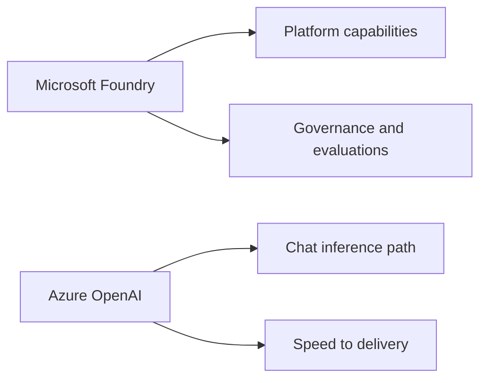
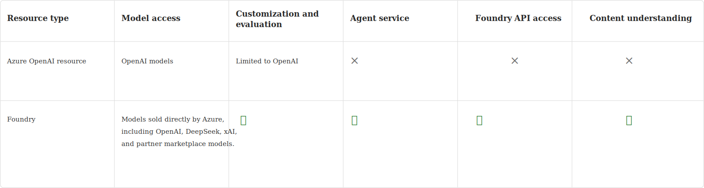

# Tradeoff: Microsoft Foundry vs Azure OpenAI

## Executive Summary

This is not a strict either-or choice.

For this project:

- Microsoft Foundry is the broader platform and governance context
- Azure OpenAI is the recommended inference path for the application chat API

## Comparison Diagram

## Visual Comparison

## What Foundry Optimizes For

- AI project organization
- Evaluations and broader AI lifecycle workflows
- Governance-oriented platform story
- Future expansion into agents and additional capabilities

## What Azure OpenAI Optimizes For

- Direct chat inference integration
- Simpler app development for OpenAI-model scenarios
- Lower delivery risk for the current API use case
- Cleaner fit for the current backend architecture

## Tradeoff Table

| Topic | Microsoft Foundry | Azure OpenAI |
|---|---|---|
| Best use | Platform strategy | App inference |
| Strength | Broader AI platform | Simpler chat integration |
| Delivery risk | Medium | Lower |
| Governance story | Stronger | Adequate but narrower |
| Fit for current `/api/chat` | Indirect | Strong |
| Future extensibility | Strong | Strong for OpenAI scenarios |

## What We Should Tell Stakeholders

### Recommended message

We are standardizing on Foundry at the platform level, while using Azure OpenAI for the application’s chat inference path. That gives us a safer implementation today without closing off future platform capabilities.

### Why this matters

- It reduces delivery risk
- It keeps the architecture explainable
- It avoids rebuilding the chat contract later
- It preserves optionality for future Foundry features

## Risks If We Explain This Poorly

- Stakeholders may assume Foundry and Azure OpenAI are competing products rather than complementary choices
- Teams may configure the wrong endpoint for the application
- Later platform discussions may sound like rework instead of planned architecture

## Current Recommendation

For the Azure AI Loan Copilot:

- Build chat inference with Azure OpenAI
- Keep Foundry as the surrounding platform direction
- Revisit deeper Foundry-native integration when we reach evaluation, governance, or agent orchestration needs
